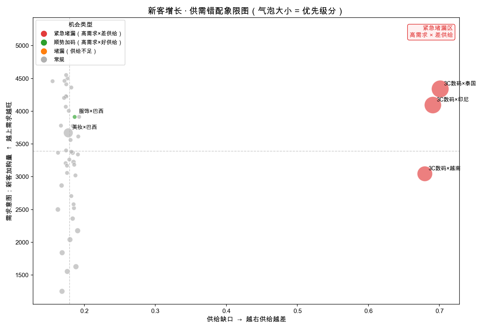

# 评委导览 · 一页看懂

> **一句话**：把"新客转化为什么掉了"这个要五个团队吵一下午的问题，变成 agent **90 秒**的诊断，
> 和一份能直接领走的行动清单。
>
> 赛道：AI Native ｜ 形态：跨域归因引擎（Python）+ Claude Code Skill

> ⚠️ **数据声明**：本仓库所有数据均为**演示用合成数据**（内埋一个真洞察 + 一个干扰项用于验证引擎），
> 市场/品类/口径仅为示意，**不代表任何真实业务**。

---

## ▶ 演示视频（90 秒看懂）

**[👉 点此观看演示视频（约 5 分钟，含屏幕字幕）](https://github.com/skye-zhai/growthlens-cross-domain-diagnose/releases/download/v1.0/growthlens-demo.mov)**

> 视频为静音 + 屏幕字幕版；旁白全文见 [演示脚本.md](演示脚本.md)。
> 也可下载仓库内 `submission/演示视频.html`，本地浏览器打开可自动播放并配中文语音。

---

## 一张图看到卡点



横轴=供给缺口，纵轴=需求意图，气泡大小=优先级。**右上角三个红色大泡（东南亚 3C）一眼锁定卡点**；
左侧绿点（巴西服饰）是"需求飙升但供给健康"的正向加码机会，不是漏点。

---

## 头号结论（会讲钱）

| | |
|---|---|
| 锚点指标 | 新客首单转化率 = **1.46%** |
| 头号杠杆 | **泰国 × 3C数码**：高意图加购 4,340 人，加购→下单仅 **11.7%**（健康基准 38%） |
| 主因 | 缺货率 **47%** + 价格竞争力 0.56 → 供给问题，归因置信度 **100%** |
| 可挽回（TOP3 合计） | **~2,928 单 / ~$351K GMV / 止损白烧 CAC ~$18K** |

---

## 30 秒讲清

**痛点**：经营分析"盲人摸象"——获取看渠道、行为看漏斗、供给看库存、物流看时效，**没人能同时看全，增长卡点掉在团队的缝里**。归因要靠多团队开会拉通，慢且互相甩锅，拉新预算(CAC)白烧。

**做什么**：锚定一个**没有单一团队 owns 的指标**（新客首单转化率），让 agent 把**站内行为 × 供给 × 搜索趋势 × 大促日历**等多域信号，在『品类 × 国家』上自动对齐，定位"高意图新客白白流失、且可通过补供给挽回"的最大增长杠杆。

**为什么不是又一个 BI**：纯漏斗只能看到"加购→下单转化低"，分不清是供给还是别的；本工具用跨域 join 把真凶定位到供给，并内置**红鲱鱼对照**——巴西美妆转化同样低，但供给健康，引擎归因置信度只给 **0.36**、不报供给问题。**它分得清"指标异常"和"异常是谁造成的"，这是看数工具做不到的一步。**

**价值**：归因从跨团队 0.5–2 天 → **分钟级**；结论从"凭经验"变成"有统计把关、可量化、可复查"；框架可平移到复购 / 大促冷启动 / 品类增长 / 商家经营参谋——**域越多越有价值，人脑装不下的多维交叉正是 AI 不可替代之处**。

---

## 凭什么可信 · 三道防线

1. **数字防线**：所有数字来自确定性 Python 计算，LLM 一个数都不编。
2. **统计防线**：样本量门槛(n≥100) + 分品类基准 z 检验 + 价格带混杂修正。48 格中仅 **15 格**过显著性、**11 格**因混杂被降权——宁可少报，不误报。
3. **因果防线**：每条结论带置信度与验证设计(A/B 或增量测试)，交付的是"排好序的强假设"，不冒充因果真理。

---

## 30 秒复现（评委可一键重跑）

```bash
python3 -m venv .venv && .venv/bin/pip install -r requirements.txt
.venv/bin/python gen_synthetic.py     # 造数据（固定种子 SEED=42，可复现）
.venv/bin/python analyze.py           # 人类可读诊断
.venv/bin/python chart.py             # 象限图 → output/quadrant.png
```

或在仓库根目录的 Claude Code 里直接调用 Skill：`/growth-diagnose`

---

## 参赛成果索引

| 成果 | 文件 |
|---|---|
| 方案文档 | [立项表.docx](立项表.docx) · [提交内容.md](提交内容.md)（报名表4列） |
| 核心代码 | [semantic.yaml](semantic.yaml) · [tools.py](tools.py) · [analyze.py](analyze.py) · [chart.py](chart.py) · [SKILL.md](.claude/skills/growth-diagnose/SKILL.md) |
| 落地数据 | [落地数据与效果验证.md](落地数据与效果验证.md) · [output/diagnosis.json](output/diagnosis.json) · [output/quadrant.png](output/quadrant.png) |
| 复用说明 | [复用说明.md](复用说明.md) |
| 演示视频 | 见上方链接；脚本 [演示脚本.md](演示脚本.md) |

> 架构与开发说明见 [README.md](README.md)。
